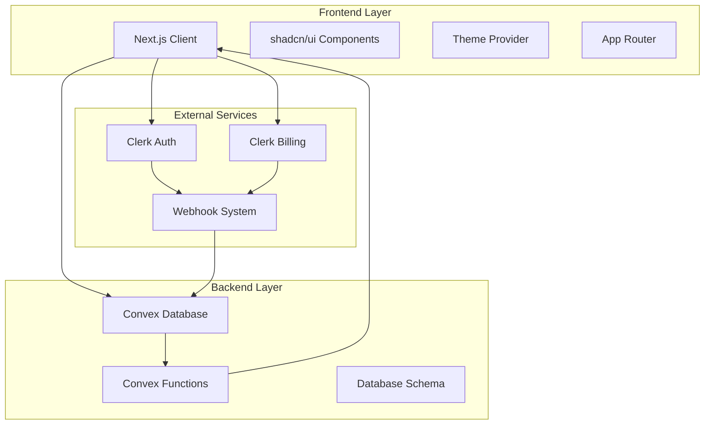
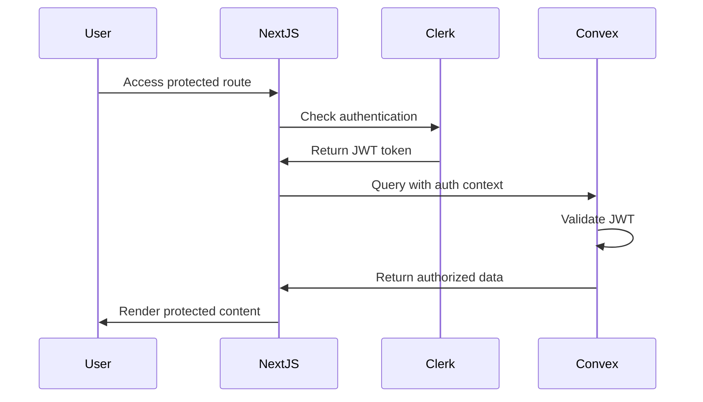
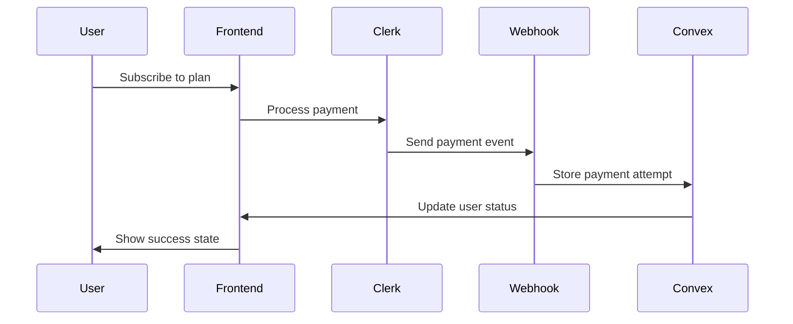

# 🏗️ ARCHITECTURE - Elite Next.js SaaS Starter Kit

## 📋 System Overview

The Elite Next.js SaaS Starter Kit follows a modern, serverless architecture pattern with real-time capabilities, type-safe operations, and production-ready integrations.

## 🎯 Architecture Principles

### Core Principles
- **Serverless First** - Leverage managed services for scalability
- **Type Safety** - TypeScript throughout the entire stack
- **Real-time by Default** - Live data synchronization
- **Component Composition** - Reusable, modular components
- **Progressive Enhancement** - Works without JavaScript, better with it

### Design Patterns
- **Vertical Slice Architecture** - Features organized by domain
- **Composition over Inheritance** - Flexible component patterns
- **Fail-fast Validation** - Early error detection and handling
- **Separation of Concerns** - Clear boundaries between layers

## 🏛️ System Architecture



## 🔧 Technical Stack

### Frontend Architecture

#### Next.js 15 with App Router
```typescript
// App Router Structure
app/
├── (landing)/          // Landing page group
├── dashboard/          // Protected dashboard
├── globals.css         // Global styles
├── layout.tsx          // Root layout
└── not-found.tsx       // Error handling
```

#### Component Architecture
```typescript
// Component Hierarchy
components/
├── ui/                 // Base UI components (shadcn/ui)
├── custom/             // Custom business components
├── providers/          // Context providers
└── layouts/            // Layout components
```

#### State Management Pattern
- **Server State**: Convex real-time queries
- **Client State**: React state and context
- **Form State**: React Hook Form with Zod validation
- **Theme State**: next-themes provider

### Backend Architecture

#### Convex Database Schema
```typescript
// Database Tables
export default defineSchema({
  users: defineTable({
    name: v.string(),
    externalId: v.string(), // Clerk ID
  }).index("byExternalId", ["externalId"]),
  
  paymentAttempts: defineTable(paymentAttemptSchemaValidator)
    .index("byPaymentId", ["payment_id"])
    .index("byUserId", ["userId"])
    .index("byPayerUserId", ["payer.user_id"]),
});
```

#### Function Organization
```typescript
// Convex Functions Structure
convex/
├── schema.ts           // Database schema
├── users.ts            // User management functions
├── paymentAttempts.ts  // Payment tracking
├── http.ts             // Webhook handlers
└── auth.config.ts      // Authentication config
```

### Authentication Flow



### Payment Integration Flow



## 🔒 Security Architecture

### Authentication Security
- **JWT Validation** - Convex validates Clerk JWTs
- **Route Protection** - Middleware-based route guards
- **Session Management** - Clerk handles session lifecycle
- **CSRF Protection** - Built-in Next.js CSRF protection

### Data Security
- **Input Validation** - Zod schemas for all inputs
- **SQL Injection Prevention** - Convex ORM prevents injection
- **XSS Protection** - React's built-in XSS prevention
- **Webhook Verification** - Svix signature validation

### Environment Security
```typescript
// Environment Variable Structure
NEXT_PUBLIC_CLERK_PUBLISHABLE_KEY=pk_test_...
CLERK_SECRET_KEY=sk_test_...
CONVEX_DEPLOYMENT=...
CLERK_WEBHOOK_SECRET=whsec_...
```

## 📊 Data Flow Architecture

### Real-time Data Flow
```typescript
// Query Pattern
const messages = useQuery(api.messages.list, { channelId });

// Mutation Pattern
const sendMessage = useMutation(api.messages.send);

// Subscription Pattern (automatic)
// Convex automatically subscribes to query changes
```

### State Synchronization
- **Optimistic Updates** - Immediate UI feedback
- **Conflict Resolution** - Last-write-wins strategy
- **Error Handling** - Graceful degradation patterns
- **Offline Support** - Planned for future versions

## 🎨 UI Architecture

### Design System
```typescript
// Theme Configuration
const theme = {
  colors: {
    primary: "hsl(var(--primary))",
    secondary: "hsl(var(--secondary))",
    // CSS custom properties
  },
  components: {
    // shadcn/ui component overrides
  }
};
```

### Component Patterns
- **Compound Components** - Complex UI patterns
- **Render Props** - Flexible component APIs
- **Higher-Order Components** - Cross-cutting concerns
- **Custom Hooks** - Reusable logic extraction

### Animation Architecture
```typescript
// Animation Libraries
import { motion } from "framer-motion";
import { MotionPrimitives } from "@/components/motion-primitives";

// Animation Patterns
const variants = {
  hidden: { opacity: 0, y: 20 },
  visible: { opacity: 1, y: 0 },
};
```

## 🚀 Deployment Architecture

### Vercel Deployment
```yaml
# vercel.json
{
  "framework": "nextjs",
  "buildCommand": "npm run build",
  "functions": {
    "app/api/**/*.ts": {
      "runtime": "nodejs18.x"
    }
  }
}
```

### Environment Management
- **Development** - Local development with hot reload
- **Preview** - Branch-based preview deployments
- **Production** - Main branch auto-deployment

### Performance Optimizations
- **Turbopack** - Ultra-fast development builds
- **Image Optimization** - Next.js automatic image optimization
- **Code Splitting** - Automatic route-based splitting
- **Edge Functions** - Planned for API routes

## 🔄 Integration Patterns

### Webhook Integration
```typescript
// Webhook Handler Pattern
export const POST = httpAction(async (ctx, request) => {
  const svix = new Webhook(process.env.CLERK_WEBHOOK_SECRET!);
  const payload = await svix.verify(body, headers);
  
  // Process webhook event
  await ctx.runMutation(internal.users.upsertFromClerk, {
    data: payload.data
  });
});
```

### Third-party Service Integration
- **Clerk** - Authentication and billing
- **Convex** - Database and real-time sync
- **Svix** - Webhook processing
- **Vercel** - Hosting and deployment

## 📈 Scalability Considerations

### Database Scaling
- **Convex Auto-scaling** - Managed scaling
- **Query Optimization** - Efficient index usage
- **Data Partitioning** - Planned for large datasets

### Frontend Scaling
- **Code Splitting** - Reduced bundle sizes
- **Lazy Loading** - On-demand component loading
- **CDN Distribution** - Global content delivery

### Monitoring & Observability
- **Error Tracking** - Planned Sentry integration
- **Performance Monitoring** - Core Web Vitals tracking
- **Analytics** - User behavior tracking

## 🔧 Development Architecture

### Code Organization
```
project/
├── app/                # Next.js App Router
├── components/         # React components
├── convex/            # Backend functions
├── lib/               # Utilities
├── hooks/             # Custom React hooks
└── docs/              # Documentation
```

### Development Workflow
1. **Local Development** - Hot reload with Turbopack
2. **Type Checking** - Continuous TypeScript validation
3. **Linting** - ESLint for code quality
4. **Testing** - Planned Jest/Playwright integration

### Build Process
```bash
# Development
npm run dev          # Start dev server with Turbopack

# Production
npm run build        # Build optimized bundle
npm run start        # Start production server
```

---

**Version**: 1.0.0  
**Last Updated**: September 17, 2025  
**Status**: Active Development
