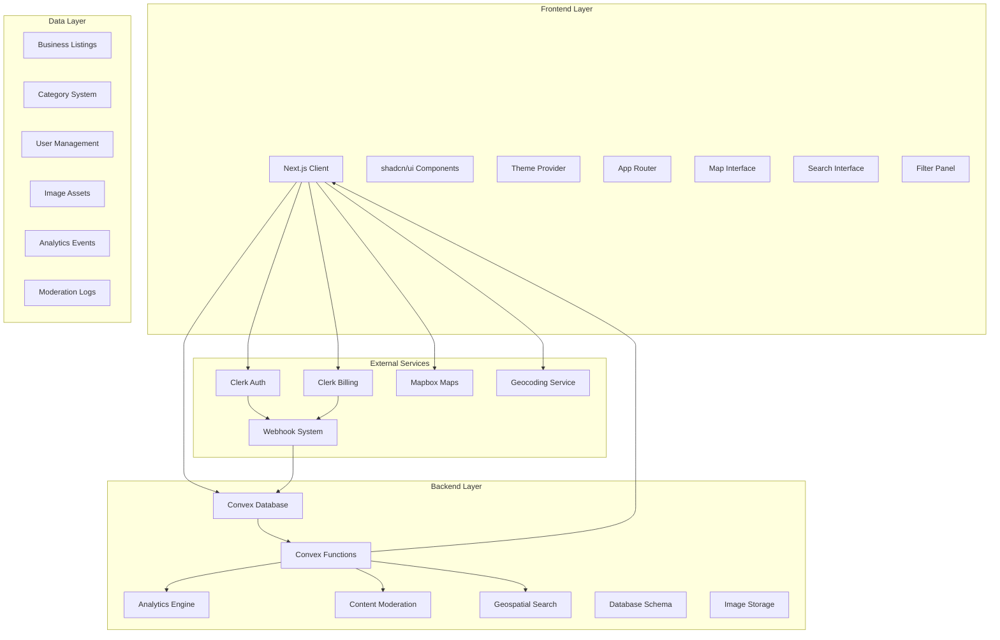
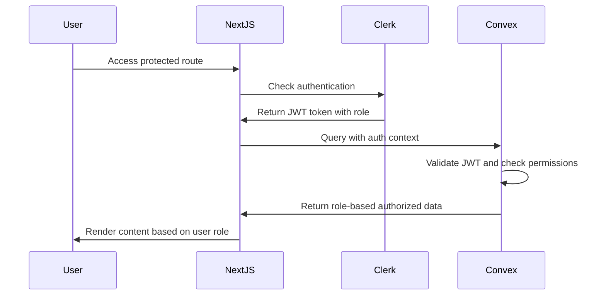
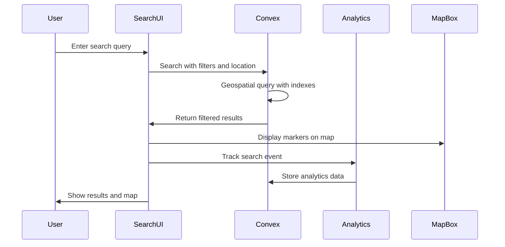
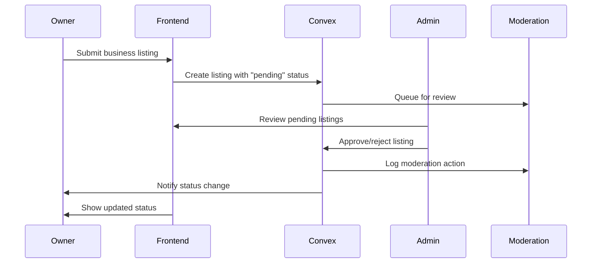
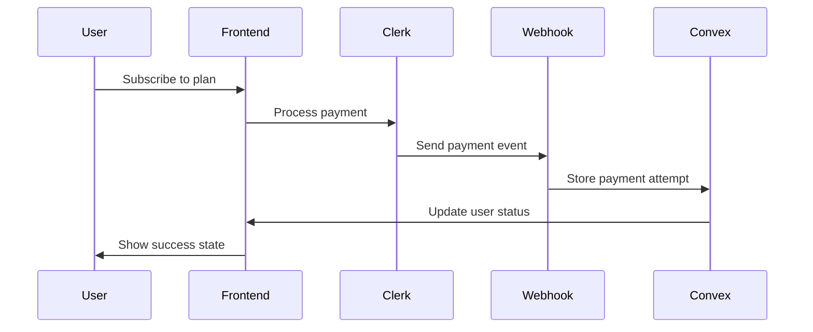

# 🏗️ ARCHITECTURE - Elite Next.js Business Directory Platform

## 📋 System Overview

The Elite Next.js Business Directory Platform is a comprehensive, production-ready business listing and discovery platform built with modern serverless architecture. It combines real-time data synchronization, geospatial search capabilities, advanced analytics, content moderation, role-based access control, and beautiful UI components to create a complete business directory solution.

**Current Implementation Status**: ✅ **FULLY IMPLEMENTED**
- Complete database schema with business listings, categories, users, analytics, and moderation
- Role-based dashboard system (Admin, Owner, Visitor)
- Advanced analytics and moderation workflows
- Comprehensive UI component library with shadcn/ui integration
- Payment integration with Clerk Billing
- Real-time data synchronization with Convex

## 🎯 Architecture Principles

### Core Principles
- **Serverless First** - Leverage managed services for infinite scalability
- **Type Safety** - TypeScript throughout the entire stack with strict validation
- **Real-time by Default** - Live data synchronization for all user interactions
- **Geospatial Optimization** - Location-based search and mapping capabilities
- **Content Moderation** - Built-in approval workflows and quality control
- **Analytics-Driven** - Comprehensive tracking and business intelligence
- **Component Composition** - Reusable, modular components
- **Progressive Enhancement** - Works without JavaScript, better with it

### Design Patterns
- **Vertical Slice Architecture** - Features organized by business domain
- **Composition over Inheritance** - Flexible component patterns
- **Fail-fast Validation** - Early error detection with Zod schemas
- **Separation of Concerns** - Clear boundaries between layers
- **Event-Driven Architecture** - Analytics and moderation through events
- **Optimistic UI Updates** - Immediate feedback with eventual consistency

## 🏛️ System Architecture



## 🔧 Technical Stack

### Frontend Architecture

#### Next.js 15 with App Router (✅ IMPLEMENTED)
```typescript
// Actual App Router Structure
app/
├── (landing)/          // ✅ Landing page with hero, features, testimonials
│   ├── page.tsx        // Main landing page
│   ├── hero-section.tsx
│   ├── features-one.tsx
│   ├── testimonials.tsx
│   ├── call-to-action.tsx
│   └── components/     // Landing-specific components
├── dashboard/          // ✅ Role-based dashboard system
│   ├── admin/          // ✅ Admin-only analytics and moderation
│   │   ├── analytics/  // Business analytics dashboard
│   │   ├── categories/ // Category management
│   │   ├── moderation/ // Content moderation interface
│   │   └── page.tsx    // Admin dashboard home
│   ├── owner/          // ✅ Business owner interface
│   │   ├── create/     // Create new listings
│   │   ├── edit/       // Edit existing listings
│   │   ├── listings/   // Manage owned listings
│   │   └── page.tsx    // Owner dashboard home
│   ├── payment-gated/  // ✅ Premium features
│   ├── layout.tsx      // Dashboard layout with sidebar
│   └── page.tsx        // Main dashboard
├── directory/          // ✅ Public business directory
│   ├── page.tsx        // Main directory search page
│   ├── category/       // Category-based browsing
│   ├── listing/        // Individual business pages
│   └── search/         // Advanced search interface
├── globals.css         // ✅ Global styles with design system
├── layout.tsx          // ✅ Root layout with providers
└── not-found.tsx       // ✅ Custom 404 page
```

#### Component Architecture (✅ IMPLEMENTED)
```typescript
// Actual Component Hierarchy
components/
├── ui/                 // ✅ Complete shadcn/ui base components
│   ├── button.tsx      // Button variants with design system
│   ├── card.tsx        // Card layouts for listings
│   ├── dialog.tsx      // Modal dialogs
│   ├── form.tsx        // Form components with validation
│   ├── sidebar.tsx     // Dashboard sidebar navigation
│   ├── table.tsx       // Data tables for admin
│   └── [40+ components] // Complete UI component library
├── custom/             // ✅ Business-specific components
│   ├── SearchInterface.tsx     // ✅ Advanced search with filters
│   ├── MapboxMap.tsx          // ✅ Interactive map component
│   ├── SearchResults.tsx      // ✅ Business listing results
│   ├── FilterPanel.tsx        // ✅ Category and location filters
│   ├── ListingCard.tsx        // ✅ Individual business display
│   ├── ListingForm.tsx        // ✅ Business listing creation/editing
│   ├── RoleProtection.tsx     // ✅ Role-based access control
│   ├── UserOnboarding.tsx     // ✅ User onboarding flow
│   ├── AdminNotifications.tsx // ✅ Admin notification system
│   └── ImageUpload.tsx        // ✅ Image upload with variants
├── kokonutui/          // ✅ Enhanced UI components
├── magicui/            // ✅ Animation components
├── motion-primitives/  // ✅ Advanced animations
└── react-bits/         // ✅ Custom animation components
```

#### State Management Pattern
- **Server State**: Convex real-time queries with optimistic updates
- **Client State**: React state and context for UI interactions
- **Search State**: Custom hooks for search filters and results
- **Map State**: Mapbox GL state management for geospatial data
- **Form State**: React Hook Form with Zod validation
- **Theme State**: next-themes provider with design system tokens

### Backend Architecture

#### Convex Database Schema (✅ FULLY IMPLEMENTED)
```typescript
// Actual Comprehensive Business Directory Schema
export default defineSchema({
  // ✅ User Management with Business Roles
  users: defineTable({
    name: v.string(),
    externalId: v.string(), // Clerk ID
    role: v.optional(v.union(v.literal("visitor"), v.literal("owner"), v.literal("admin"))),
    email: v.optional(v.string()),
    businessName: v.optional(v.string()),
    verificationStatus: v.optional(v.union(v.literal("pending"), v.literal("verified"), v.literal("rejected"))),
    verificationMethod: v.optional(v.union(v.literal("email"), v.literal("phone"), v.literal("manual"))),
    defaultLocation: v.optional(v.object({
      lat: v.number(),
      lng: v.number(),
      address: v.string(),
    })),
    lastLoginAt: v.optional(v.number()),
    listingCount: v.optional(v.number()),
  }).index("byExternalId", ["externalId"])
    .index("byRole", ["role"])
    .index("byVerificationStatus", ["verificationStatus"]),

  // Business Listings with Geospatial Data
  listings: defineTable({
    name: v.string(),
    slug: v.string(),
    description: v.optional(v.string()),
    phone: v.optional(v.string()),
    website: v.optional(v.string()),
    email: v.optional(v.string()),
    address: addressValidator,
    location: locationValidator, // Lat/lng for geospatial queries
    categories: v.array(v.id("categories")),
    hours: v.optional(businessHoursValidator),
    images: v.array(v.id("imageAssets")),
    ownerId: v.optional(v.id("users")),
    status: v.union(v.literal("pending"), v.literal("approved"), v.literal("rejected"), v.literal("archived")),
    views: v.number(),
    phoneClicks: v.number(),
    websiteClicks: v.number(),
    directionsClicks: v.number(),
  }).index("byStatus", ["status"])
    .index("byOwner", ["ownerId"])
    .index("byLocationBounds", ["location.lat", "location.lng"])
    .index("byCategory", ["categories"])
    .index("bySlug", ["slug"]),

  // Category Hierarchy System
  categories: defineTable({
    name: v.string(),
    slug: v.string(),
    description: v.optional(v.string()),
    parentId: v.optional(v.id("categories")),
    isActive: v.boolean(),
    sortOrder: v.number(),
    listingCount: v.number(),
  }).index("byParent", ["parentId"])
    .index("byActive", ["isActive"]),

  // Image Asset Management
  imageAssets: defineTable({
    storageId: v.id("_storage"),
    filename: v.string(),
    contentType: v.string(),
    variants: v.object({
      thumbnail: v.id("_storage"),
      medium: v.id("_storage"),
      full: v.id("_storage"),
    }),
    uploadedBy: v.id("users"),
    listingId: v.optional(v.id("listings")),
    moderationStatus: v.union(v.literal("pending"), v.literal("approved"), v.literal("rejected")),
  }).index("byListing", ["listingId"])
    .index("byModerationStatus", ["moderationStatus"]),

  // Analytics and Event Tracking
  analyticsEvents: defineTable({
    type: v.union(
      v.literal("listing_view"),
      v.literal("search_query"),
      v.literal("contact_click"),
      v.literal("directions_click"),
      v.literal("map_interaction")
    ),
    listingId: v.optional(v.id("listings")),
    userId: v.optional(v.id("users")),
    sessionId: v.string(),
    metadata: v.object({
      query: v.optional(v.string()),
      location: v.optional(locationValidator),
      contactType: v.optional(v.string()),
      userAgent: v.optional(v.string()),
    }),
    retentionDate: v.number(),
  }).index("byType", ["type"])
    .index("byListing", ["listingId"]),

  // Content Moderation System
  moderationLogs: defineTable({
    action: v.union(v.literal("approve"), v.literal("reject"), v.literal("archive")),
    entityType: v.union(v.literal("listing"), v.literal("image"), v.literal("user")),
    entityId: v.string(),
    moderatorId: v.id("users"),
    reason: v.optional(v.string()),
    automated: v.boolean(),
  }).index("byEntity", ["entityType", "entityId"])
    .index("byModerator", ["moderatorId"]),

  // Payment System (Existing)
  paymentAttempts: defineTable(paymentAttemptSchemaValidator)
    .index("byPaymentId", ["payment_id"])
    .index("byUserId", ["userId"]),
});
```

#### Function Organization (✅ IMPLEMENTED)
```typescript
// Actual Convex Functions Structure
convex/
├── schema.ts           // ✅ Comprehensive database schema (216 lines)
├── users.ts            // ✅ User management with roles and verification
├── listings.ts         // ✅ Business listing CRUD operations
├── businesses.ts       // ✅ Business-specific operations
├── categories.ts       // ✅ Category management system
├── images.ts           // ✅ Image upload and processing with variants
├── analytics.ts        // ✅ Event tracking and reporting
├── moderationLogs.ts   // ✅ Content moderation system
├── paymentAttempts.ts  // ✅ Payment tracking with Clerk integration
├── http.ts             // ✅ Webhook handlers for Clerk events
└── auth.config.ts      // ✅ Authentication configuration
```

### Authentication Flow



### Business Directory Search Flow



### Content Moderation Flow



### Payment Integration Flow



## 🔒 Security Architecture

### Authentication Security
- **JWT Validation** - Convex validates Clerk JWTs
- **Route Protection** - Middleware-based route guards
- **Session Management** - Clerk handles session lifecycle
- **CSRF Protection** - Built-in Next.js CSRF protection

### Data Security
- **Input Validation** - Zod schemas for all inputs
- **SQL Injection Prevention** - Convex ORM prevents injection
- **XSS Protection** - React's built-in XSS prevention
- **Webhook Verification** - Svix signature validation

### Environment Security
```typescript
// Environment Variable Structure
NEXT_PUBLIC_CLERK_PUBLISHABLE_KEY=pk_test_...
CLERK_SECRET_KEY=sk_test_...
CONVEX_DEPLOYMENT=...
CLERK_WEBHOOK_SECRET=whsec_...
```

## 📊 Data Flow Architecture

### Real-time Data Flow
```typescript
// Business Search Query Pattern
const { results, isLoading } = useBusinessSearch({
  query: "restaurants",
  location: { lat: 40.7128, lng: -74.0060 },
  categories: ["food"],
  radius: 5000
});

// Geospatial Query Pattern
const nearbyListings = useQuery(api.listings.searchByLocation, {
  bounds: { north: 40.8, south: 40.6, east: -73.9, west: -74.1 },
  categories: ["retail"]
});

// Analytics Mutation Pattern
const trackEvent = useMutation(api.analytics.trackEvent);
await trackEvent({
  type: "listing_view",
  listingId: "listing123",
  metadata: { source: "search_results" }
});

// Real-time Updates (automatic)
// Convex automatically subscribes to query changes
// New listings appear instantly when approved
```

### State Synchronization
- **Optimistic Updates** - Immediate UI feedback for user actions
- **Geospatial Indexing** - Efficient location-based queries
- **Real-time Analytics** - Live event tracking and aggregation
- **Content Moderation** - Instant status updates for listings
- **Conflict Resolution** - Last-write-wins with audit trails
- **Error Handling** - Graceful degradation with retry logic
- **Offline Support** - Planned with service worker caching

## 🎨 UI Architecture

### Design System
```typescript
// Theme Configuration
const theme = {
  colors: {
    primary: "hsl(var(--primary))",
    secondary: "hsl(var(--secondary))",
    // CSS custom properties
  },
  components: {
    // shadcn/ui component overrides
  }
};
```

### Component Patterns
- **Compound Components** - Complex UI patterns
- **Render Props** - Flexible component APIs
- **Higher-Order Components** - Cross-cutting concerns
- **Custom Hooks** - Reusable logic extraction

### Animation Architecture
```typescript
// Enhanced animations for business directory
import { motion } from "framer-motion";

const listingVariants = {
  hidden: { opacity: 0, y: 20 },
  visible: { opacity: 1, y: 0 },
  hover: { scale: 1.02, transition: { duration: 0.2 } }
};
```

## 🚀 Deployment Architecture

### Vercel Deployment (Optimized for Business Directory)
- **Geospatial Performance** - Edge functions for location-based queries
- **Image Optimization** - Automatic optimization for business photos
- **Analytics Edge** - Real-time event processing
- **Map Tile Caching** - Optimized Mapbox integration

## 🔄 Integration Patterns

### Webhook Integration
```typescript
// Webhook Handler Pattern
export const POST = httpAction(async (ctx, request) => {
  const svix = new Webhook(process.env.CLERK_WEBHOOK_SECRET!);
  const payload = await svix.verify(body, headers);
  
  // Process webhook event
  await ctx.runMutation(internal.users.upsertFromClerk, {
    data: payload.data
  });
});
```

### Third-party Service Integration
- **Clerk** - Authentication and billing
- **Convex** - Database and real-time sync
- **Svix** - Webhook processing
- **Vercel** - Hosting and deployment

## 📈 Scalability Considerations

### Database Scaling
- **Convex Auto-scaling** - Managed scaling for business directory
- **Geospatial Indexing** - Optimized location-based queries
- **Analytics Partitioning** - Time-based data retention
- **Image Storage** - Efficient asset management with variants

### Performance Monitoring
- **Real-time Analytics** - Business listing performance tracking
- **Search Performance** - Query optimization and caching
- **Map Performance** - Optimized marker clustering and viewport loading

## 🔧 Development Architecture

### Code Organization
```
business-directory/
├── app/                # Next.js App Router with directory routes
├── components/         # React components with business-specific UI
├── convex/            # Backend functions for listings, analytics, moderation
├── lib/               # Utilities including geocoding and role management
├── hooks/             # Custom hooks for search, geolocation, analytics
```

### Development Workflow
1. **Local Development** - Hot reload with Turbopack and Convex dev mode
2. **Type Checking** - Continuous TypeScript validation with strict mode

### Build Process
```bash
npm run dev          # Start dev server with Turbopack
npx convex dev       # Start Convex backend in development mode
```
**Version**: 2.0.0 - Business Directory Platform
