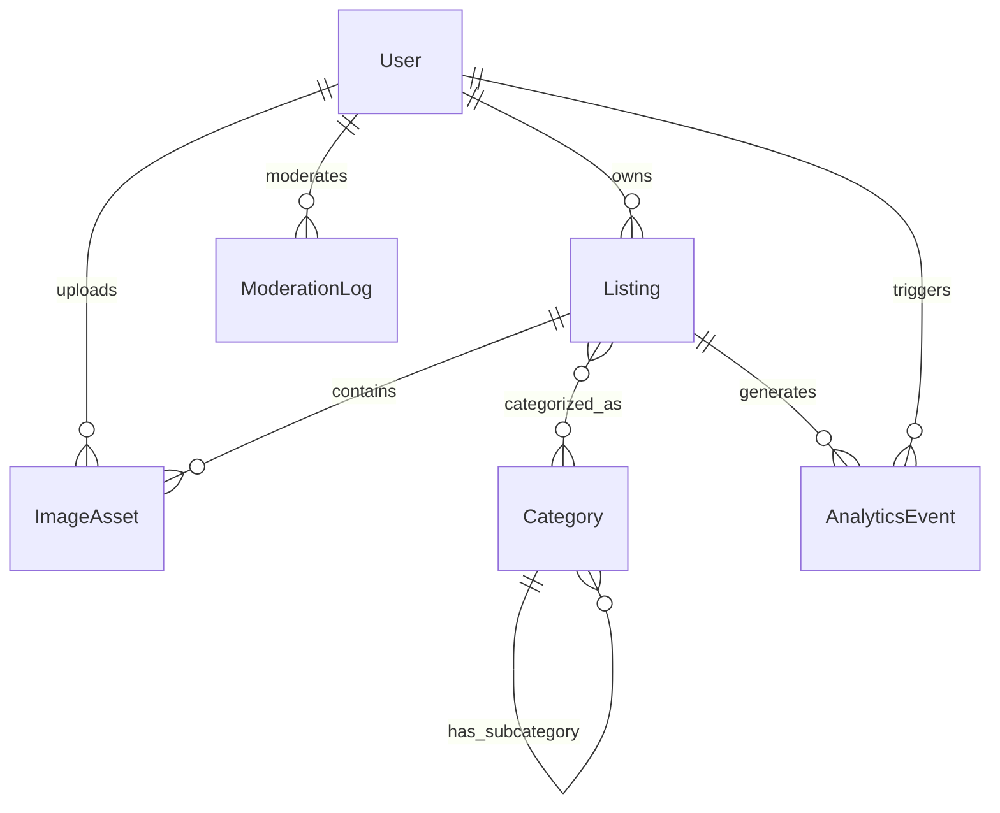

# Data Model: Local Business Directory MVP

**Date**: 2025-09-22  
**Phase**: 1 - Design  
**Status**: Complete

## Entity Definitions

### 1. Listing
**Purpose**: Core business entry discoverable by visitors

```typescript
interface Listing {
  _id: Id<"listings">
  _creationTime: number
  
  // Core Information
  name: string                    // Business name (required)
  slug: string                   // URL-friendly identifier (auto-generated)
  description?: string           // Business description (optional)
  
  // Contact & Location
  phone?: string                // Phone number (at least one contact required)
  website?: string              // Website URL (at least one contact required)
  email?: string                // Contact email (optional)
  
  // Address & Geography
  address: {
    line1: string               // Street address
    city: string               // City
    region: string              // State/Province
    postalCode: string          // ZIP/Postal code
    country: string             // Country code (ISO 3166)
  }
  location: {
    lat: number                 // Latitude (-90 to 90)
    lng: number                 // Longitude (-180 to 180)
  }
  
  // Business Details
  categories: Id<"categories">[] // Associated categories
  hours?: BusinessHours[]       // Operating hours
  images: Id<"imageAssets">[]   // Associated images
  
  // Ownership & Status
  ownerId?: Id<"users">         // Owner (null for admin-created)
  status: "pending" | "approved" | "rejected" | "archived"
  
  // Moderation
  moderationNotes?: string      // Admin notes for rejection/changes
  moderatedBy?: Id<"users">     // Admin who moderated
  moderatedAt?: number          // Moderation timestamp
  
  // Analytics
  views: number                 // Total listing views
  phoneClicks: number           // Phone number clicks
  websiteClicks: number         // Website clicks
  directionsClicks: number      // Directions clicks
  
  // Metadata
  lastUpdatedBy?: Id<"users">   // Last user to update
  updatedAt: number             // Last update timestamp
}

interface BusinessHours {
  day: 0 | 1 | 2 | 3 | 4 | 5 | 6  // 0=Sunday, 1=Monday, etc.
  open: string                     // "09:00" format
  close: string                    // "17:00" format
  closed: boolean                  // True if closed this day
}
```

**Indexes Required**:
- `byStatus` - For admin moderation queue
- `byOwner` - For owner dashboard
- `byLocationBounds` - For geographical search (lat, lng ranges)
- `byCategory` - For category filtering
- `bySlug` - For URL routing
- `byCreationTime` - For recent listings

### 2. Category
**Purpose**: Classification system for business types

```typescript
interface Category {
  _id: Id<"categories">
  _creationTime: number
  
  // Core Information
  name: string                  // Display name (e.g., "Restaurants")
  slug: string                 // URL-friendly (e.g., "restaurants")
  description?: string         // Category description
  
  // Hierarchy
  parentId?: Id<"categories">  // Parent category (for subcategories)
  
  // Metadata
  isActive: boolean            // Can be used for new listings
  sortOrder: number            // Display ordering
  listingCount: number         // Cached count of active listings
  
  // Management
  createdBy: Id<"users">       // Admin who created
  updatedAt: number            // Last update timestamp
}
```

**Indexes Required**:
- `byParent` - For category hierarchy
- `byActive` - For active categories only
- `bySortOrder` - For ordered display

### 3. User (Extended from existing)
**Purpose**: System users with roles and permissions

```typescript
// Extends existing users table
interface User {
  _id: Id<"users">
  _creationTime: number
  
  // Existing fields from current schema
  name: string
  externalId: string           // Clerk user ID
  
  // New fields for business directory
  role: "visitor" | "owner" | "admin"
  email?: string               // Cached from Clerk
  
  // Owner-specific fields
  businessName?: string        // For business owners
  verificationStatus?: "pending" | "verified" | "rejected"
  verificationMethod?: "email" | "phone" | "manual"
  
  // Preferences
  defaultLocation?: {
    lat: number
    lng: number
    address: string
  }
  
  // Analytics
  lastLoginAt?: number
  listingCount: number         // Cached count of owned listings
}
```

**Indexes Required** (in addition to existing):
- `byRole` - For role-based queries
- `byVerificationStatus` - For verification management

### 4. ImageAsset
**Purpose**: Image storage and metadata for listings

```typescript
interface ImageAsset {
  _id: Id<"imageAssets">
  _creationTime: number
  
  // File Information
  storageId: Id<"_storage">    // Convex file storage reference
  filename: string             // Original filename
  contentType: string          // MIME type
  size: number                 // File size in bytes
  
  // Image Properties
  width: number                // Image width in pixels
  height: number               // Image height in pixels
  altText?: string             // Accessibility description
  
  // Variants (different sizes)
  variants: {
    thumbnail: Id<"_storage">   // 150x150px
    medium: Id<"_storage">      // 400x300px
    full: Id<"_storage">        // Original size
  }
  
  // Ownership
  uploadedBy: Id<"users">      // User who uploaded
  listingId?: Id<"listings">   // Associated listing
  
  // Status
  isActive: boolean            // Not deleted
  moderationStatus: "pending" | "approved" | "rejected"
}
```

**Indexes Required**:
- `byListing` - For listing images
- `byUploader` - For user's uploaded images
- `byModerationStatus` - For image moderation

### 5. AnalyticsEvent
**Purpose**: Track user interactions and system metrics

```typescript
interface AnalyticsEvent {
  _id: Id<"analyticsEvents">
  _creationTime: number
  
  // Event Information
  type: "listing_view" | "search_query" | "contact_click" | "directions_click" | "map_interaction"
  
  // Context
  listingId?: Id<"listings">   // Associated listing (if applicable)
  userId?: Id<"users">         // User who triggered event (if authenticated)
  sessionId: string            // Anonymous session identifier
  
  // Event Data
  metadata: {
    // For search_query
    query?: string
    category?: string
    location?: { lat: number, lng: number }
    resultCount?: number
    
    // For contact_click
    contactType?: "phone" | "website" | "email"
    
    // For map_interaction
    action?: "zoom" | "pan" | "cluster_click" | "marker_click"
    zoomLevel?: number
    
    // General
    userAgent?: string
    referrer?: string
    viewport?: { width: number, height: number }
  }
  
  // Privacy
  ipHash?: string              // Hashed IP for rate limiting
  retentionDate: number        // Automatic cleanup date
}
```

**Indexes Required**:
- `byType` - For event type analytics
- `byListing` - For listing-specific metrics
- `byCreationTime` - For time-based analytics
- `byRetentionDate` - For cleanup job

### 6. ModerationLog
**Purpose**: Audit trail for moderation actions

```typescript
interface ModerationLog {
  _id: Id<"moderationLogs">
  _creationTime: number
  
  // Action Information
  action: "approve" | "reject" | "request_changes" | "archive" | "restore"
  entityType: "listing" | "image" | "user"
  entityId: string             // ID of moderated entity
  
  // Moderation Details
  moderatorId: Id<"users">     // Admin who performed action
  reason?: string              // Reason for action
  notes?: string               // Additional notes
  
  // Context
  previousStatus?: string      // Status before action
  newStatus: string            // Status after action
  
  // Metadata
  automated: boolean           // True if automated action
  reviewTime?: number          // Time spent reviewing (seconds)
}
```

**Indexes Required**:
- `byEntity` - For entity-specific history
- `byModerator` - For moderator activity
- `byCreationTime` - For chronological view

## Relationships



## Validation Rules

### Listing Validation
- At least one contact method required (phone OR website OR email)
- Location coordinates must be valid (-90≤lat≤90, -180≤lng≤180)
- Status transitions: pending→approved/rejected, approved→pending (on edit), rejected→pending (on edit)
- Categories must be active
- Images limited to 10 per listing
- Name must be unique within 1km radius (duplicate detection)

### Category Validation
- Name must be unique among siblings
- Slug auto-generated from name
- Cannot delete category with active listings
- Parent category must exist and be active

### User Validation
- External ID must match Clerk user ID
- Role changes require admin permission
- Email format validation
- Business owners limited to 5 listings (MVP)

### Image Validation
- File size ≤ 10MB
- Supported formats: JPEG, PNG, WebP
- Dimensions ≥ 200x200px for quality
- Alt text encouraged for accessibility

## Data Integrity

### Constraints
- Listing.ownerId must exist in users table
- Category IDs in listing.categories must exist and be active
- Image IDs in listing.images must exist and be active
- Location coordinates must be within valid ranges

### Cascade Rules
- User deletion: Transfer listings to admin or mark as orphaned
- Category deletion: Remove from all listings, require recategorization
- Image deletion: Remove from all listings automatically

### Cleanup Jobs
- Analytics events older than 12 months
- Rejected listings older than 90 days
- Orphaned images not associated with listings
- Inactive user accounts after 24 months

## Performance Considerations

### Query Patterns
- Geographical search: Bounding box queries with client-side distance calculation
- Category filtering: Index-based filtering with real-time updates
- Owner dashboard: User-specific listing queries
- Admin moderation: Status-based queues with pagination

### Caching Strategy
- Category list: Client-side caching (rarely changes)
- User location: Browser localStorage
- Search results: Short-term caching (5 minutes)
- Image URLs: CDN caching via Convex

### Scaling Limits (MVP)
- 1,000 listings maximum
- 100 categories maximum
- 10 images per listing
- 5 listings per owner
- 1,000 analytics events per day
